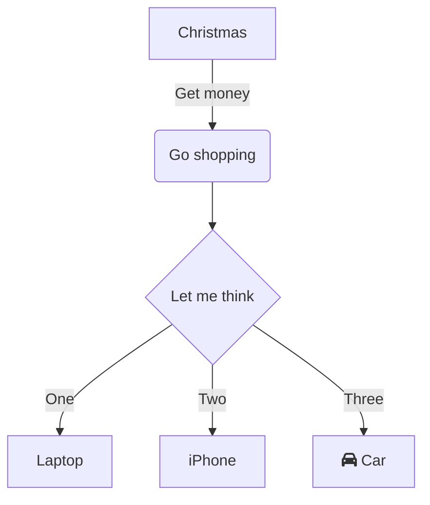

# TODO
- HealthCheck
- Failover
- Como puedo forzar un nack? puedo publicar haciendo delay?
- Agregar librería control de Async
- e2e
- console project - Hosting environment: Production
- Timeout MassTransit
- Resilencia del http client

# Diagram

