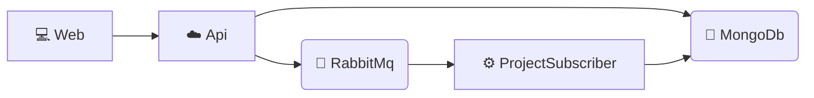

# TODO
- Como puedo forzar un nack? puedo publicar haciendo delay?
- Agregar librería control de Async
- e2e
- console project - Hosting environment: Production
- Timeout MassTransit
- Resilencia del http client
- Logger using static methods
- auth-token no guardado con localStorage!!!! (activar Content-Security-Policy??)  
  - Mejorar creación del refresh token?
  - Mejorar creación del fingerprint
  - HybridCache para gestionar el acceso a los refresh
  - AddFingerprintCookie y AddRefreshTokenCookie se repite código
- Cambiar patrón url: la versión al final 
- Front
  - Agregar bearer token automáticamente
  - Forma más segura de alma¡cenar el bearer token en local
  - Logout
  - Listado de proyectos
  - Configuración general del proyecto: url del api, url por defecto el logearse, config del grid...
  - Importar de una todas las páginas/componentes de un directorio
  - Repositoriuo de Mongo modifica N elementos (HandleReuseAttack example)
  - Índices mongo
  - CSS más semánticos (bgc-validation-error...)
``` csharp
await collection.Indexes.CreateManyAsync([
    new CreateIndexModel<RefreshToken>(
        Builders<RefreshToken>.IndexKeys.Ascending(x => x.UserId)
    ),
    new CreateIndexModel<RefreshToken>(
        Builders<RefreshToken>.IndexKeys.Ascending(x => x.TokenHash),
        new CreateIndexOptions { Unique = true }
    ),
    new CreateIndexModel<RefreshToken>(
        Builders<RefreshToken>.IndexKeys.Ascending(x => x.ExpiresAt),
        new CreateIndexOptions { ExpireAfter = TimeSpan.Zero }
    )
]);
```

# Diagram

