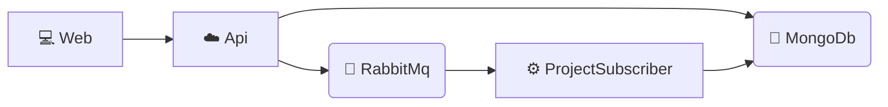

# dotnet-microservices

> ⚠️ **Experimentation / learning project.** It exists to try out patterns, libraries, and architecture decisions for a modern .NET microservice. **It is not meant to be deployed to production as-is** — some pieces are deliberately simplified or stubbed (see [Status and limitations](#status-and-limitations)).

## What is it?

A small project-management service built as a microservice: an **HTTP API** that persists to **MongoDB** and publishes domain events to **RabbitMQ**, a **worker** that consumes them, and a **SPA** that consumes the API. Everything is run and observed in one place with **.NET Aspire**.

The point isn't the domain itself (it's minimal) but exercising end-to-end concerns: vertical slices with Minimal APIs, API versioning, authentication with JWT + rotating refresh tokens in an httpOnly cookie + fingerprint binding, messaging with MassTransit, observability with OpenTelemetry, and local orchestration with Aspire.

## Architecture



- The **Api** serves HTTP, writes to MongoDB, and publishes events to RabbitMQ.
- The **ProjectSubscriber** (worker) consumes those events asynchronously.
- The **Web** (SPA) consumes the Api; in development, through the Vite proxy that Aspire orchestrates.
- **Aspire** also starts MongoDB, RabbitMQ, and a Grafana LGTM container to which all telemetry (traces, metrics, logs) is exported.

## Tech stack

| Layer | Stack |
|-------|-------|
| Runtime | **.NET 10** |
| Local orchestration | **.NET Aspire** (AppHost + ServiceDefaults) |
| API | **Minimal APIs** in *vertical slices*, URL-segment versioning (`Asp.Versioning`), validation with **FluentValidation** (SharpGrip auto-validation) |
| Auth | **JWT Bearer** + **HMAC** scheme, rotating refresh tokens in an httpOnly cookie, anti-sidejacking *fingerprint* (OWASP) |
| Persistence | **MongoDB** behind an `IRepository<T>` abstraction |
| Messaging | **MassTransit** over **RabbitMQ** |
| Observability | **OpenTelemetry** (OTLP) → **Grafana LGTM** |
| Frontend | **React 19** + **Vite** + **TypeScript** |
| Tests | **xUnit** (unit) + `Microsoft.AspNetCore.Mvc.Testing` (integration) |

## Folder structure

```
dotnet-microservices.slnx          # Solution
src/
  _aspire/
    Aspire.AppHost/                 # Orchestration: declares and starts every resource
    Aspire.ServiceDefaults/         # Shared defaults (OTel, health checks, resilience)
  Models/                           # Shared domain entities, DTOs, and events
  Infrastructure/                   # Data access: IRepository<T> + MongoDbRepository
  web/
    Api/                            # HTTP host: pipeline, auth, versioning, DI, middleware
    Api.Features/                   # Vertical slices (endpoints) + business services (auth…)
    ui/                             # React + Vite + TypeScript SPA
  worker/
    Product.Consumer/               # MassTransit worker consuming RabbitMQ events
test/
  unit/Api.Features.Test.Unit/      # Unit tests (xUnit)
Api.Features.Test.Integration/      # Integration tests (WebApplicationFactory)
```

Each API feature lives in `Api.Features/<Area>/<Feature>/v1/` and is self-contained (`Handler`, `Request`, `Response`, `Validator`, `Mapper`). Endpoints implement `IEndpointModule` and are **auto-discovered** via reflection — no manual registration.

## Running it

Requirements: **.NET 10 SDK**, **Node.js**, and **Docker** (for the Mongo, RabbitMQ, and LGTM containers Aspire starts).

```bash
dotnet run --project src/_aspire/Aspire.AppHost
```

This brings up the API, the worker, the SPA, MongoDB, RabbitMQ, and Grafana LGTM, and opens the Aspire dashboard to inspect state, logs, and traces for everything together.

> Development configuration (ports, `VITE_API_URL`, proxy, cookies) and internal architecture details are documented in [`CLAUDE.md`](./CLAUDE.md).

### Tests

```bash
dotnet test                                              # all
dotnet test test/unit/Api.Features.Test.Unit            # one project
dotnet test --filter "FullyQualifiedName~SomeTestName"  # a single test
```

## Status and limitations

Intentionally simplified (this is a sandbox, not production):

- **No user store**: login is hardcoded in `Auth/Login/v1/Handler.cs`.
- **HMAC validation is a stub**: `HmacAuthenticationHandler.ValidateHmac` always returns `true`.
- Missing MongoDB indexes, fine-grained timeout/resilience handling, and E2E tests (see Roadmap).

## Roadmap / TODO

- How can I force a nack? Publish with a delay?
- E2E
- Console project — Hosting environment: Production
- MassTransit timeout
- HTTP client resilience
- Logger using static methods
- Auth token not stored in localStorage (enable Content-Security-Policy?)
  - Improve refresh token creation?
  - HybridCache to manage refresh access
- Change URL pattern: version at the end
- Front
  - Attach the bearer token automatically
  - Safer way to store the bearer token locally
  - Logout
  - Projects listing
  - General project config: api url, default url on login, grid config…
  - Import all pages/components from a directory at once
  - Mongo repository that updates N elements (example in `HandleReuseAttack`)
  - `errorMessage` always fires; it should only fire after submitting the form
  - More semantic CSS (`bgc-validation-error`…)
  - Mongo indexes

```csharp
await collection.Indexes.CreateManyAsync([
    new CreateIndexModel<RefreshToken>(
        Builders<RefreshToken>.IndexKeys.Ascending(x => x.UserId)
    ),
    new CreateIndexModel<RefreshToken>(
        Builders<RefreshToken>.IndexKeys.Ascending(x => x.TokenHash),
        new CreateIndexOptions { Unique = true }
    ),
    new CreateIndexModel<RefreshToken>(
        Builders<RefreshToken>.IndexKeys.Ascending(x => x.ExpiresAt),
        new CreateIndexOptions { ExpireAfter = TimeSpan.Zero }
    )
]);
```
