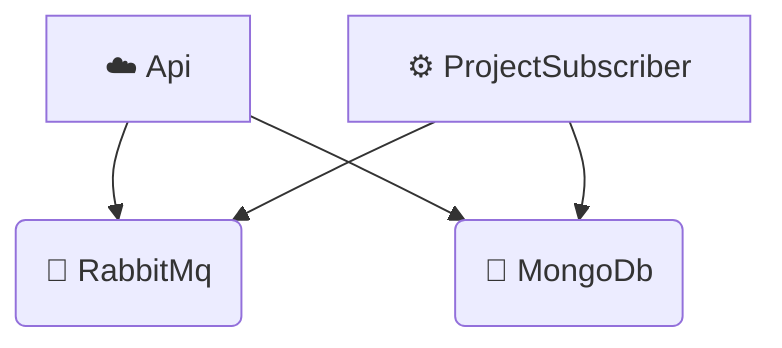

# TODO
- Como puedo forzar un nack? puedo publicar haciendo delay?
- Agregar librería control de Async
- e2e
- console project - Hosting environment: Production
- Timeout MassTransit
- Resilencia del http client
- Front
  - Agregar bearer token automáticamente
  - Forma más segura de alma¡cenar el bearer token en local
  - Logout
  - Listado de proyectos

# Diagram
